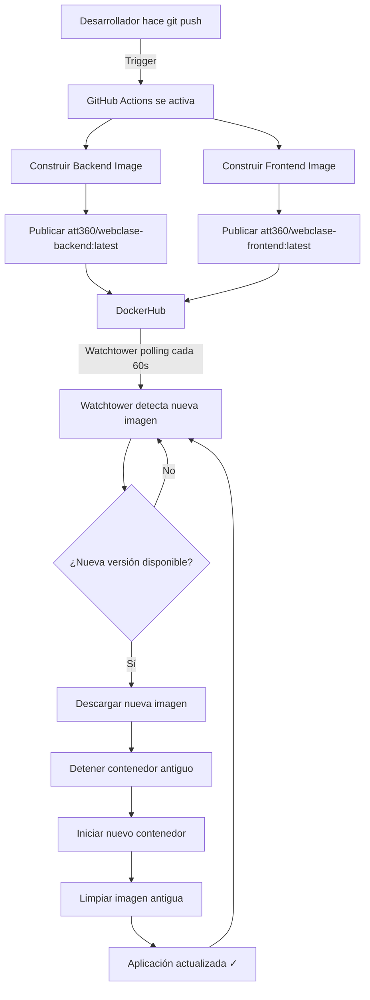
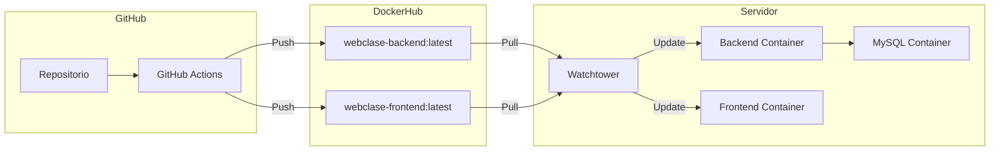
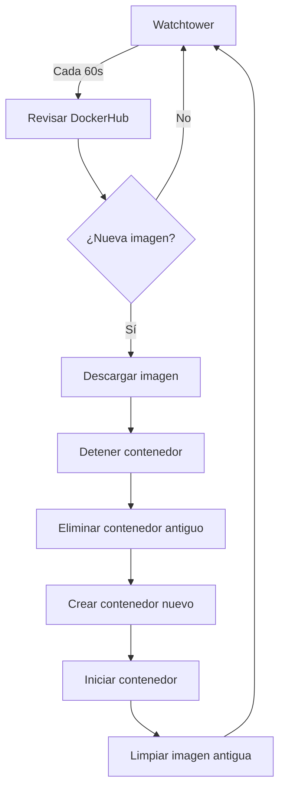

# Diagrama del Flujo CI/CD

## Flujo Automático de Deployment



## Componentes del Sistema



## Configuración de Watchtower



## Configuración de Secrets

Para que funcione el sistema, necesitas configurar en GitHub:

```
GitHub Repository
└── Settings
    └── Secrets and variables
        └── Actions
            ├── DOCKERHUB_USERNAME → tu_usuario
            └── DOCKERHUB_TOKEN → tu_token_de_acceso
```

## Comandos Útiles

### Monitoreo en Tiempo Real

```bash
# Ver logs de Watchtower
docker logs webclase-watchtower -f

# Ver logs de todos los servicios
docker-compose logs -f

# Ver solo backend
docker logs webclase-backend -f

# Ver solo frontend
docker logs webclase-frontend -f
```

### Gestión de Contenedores

```bash
# Ver estado
docker-compose ps

# Reiniciar todo
docker-compose restart

# Detener todo
docker-compose down

# Iniciar todo
docker-compose up -d

# Forzar actualización inmediata
docker exec webclase-watchtower /watchtower --run-once
```

### Verificar Imágenes

```bash
# Ver imágenes locales
docker images | grep webclase

# Ver detalles de una imagen
docker inspect att360/webclase-backend:latest

# Eliminar imágenes antiguas manualmente
docker image prune -a
```

## Tiempos del Sistema

| Acción | Tiempo |
|--------|--------|
| GitHub Actions construye imágenes | ~3-5 minutos |
| Watchtower revisa actualizaciones | Cada 60 segundos |
| Descarga de imagen nueva | ~30-60 segundos |
| Reinicio de contenedor | ~5-10 segundos |
| **Total desde push hasta deploy** | **~4-7 minutos** |

## Notificaciones (Opcional)

Puedes configurar notificaciones agregando a Watchtower:

### Slack
```yaml
environment:
  - WATCHTOWER_NOTIFICATIONS=slack
  - WATCHTOWER_NOTIFICATION_SLACK_HOOK_URL=https://hooks.slack.com/...
```

### Discord
```yaml
environment:
  - WATCHTOWER_NOTIFICATIONS=slack
  - WATCHTOWER_NOTIFICATION_SLACK_HOOK_URL=https://discord.com/api/webhooks/...
```

### Email
```yaml
environment:
  - WATCHTOWER_NOTIFICATIONS=email
  - WATCHTOWER_NOTIFICATION_EMAIL_FROM=tu@email.com
  - WATCHTOWER_NOTIFICATION_EMAIL_TO=tu@email.com
  - WATCHTOWER_NOTIFICATION_EMAIL_SERVER=smtp.gmail.com
  - WATCHTOWER_NOTIFICATION_EMAIL_SERVER_PORT=587
```

## Ajustar Frecuencia

Para cambiar cada cuánto Watchtower revisa:

```yaml
# En docker-compose.yml
environment:
  - WATCHTOWER_POLL_INTERVAL=300  # 5 minutos
  - WATCHTOWER_POLL_INTERVAL=600  # 10 minutos
  - WATCHTOWER_POLL_INTERVAL=60   # 1 minuto (actual)
```
